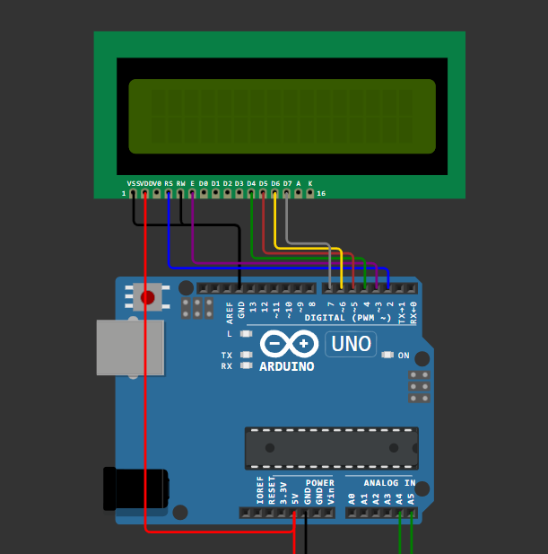

# IOTS-Embedded-Gruppredovisning

### About:
This is a c program that displays a new advert every 10 second on a lcd in microcontroller like arduino uno 3.

### edited by:

Soheil Mohandasian  
Cheragh ALi Ramazani  
Seif Said  
Victor Glans